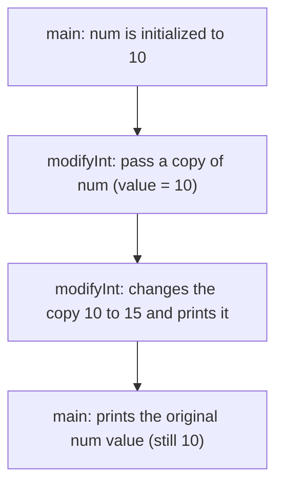

```mermaid
graph TD;
A["main: num is initialized to 10"] --> B["modifyInt: pass a copy of num (value = 10)"]
    B-->C["modifyInt: changes the copy 10 to 15 and prints it"];
    C --> D["main: prints the original num value (still 10)"];
```