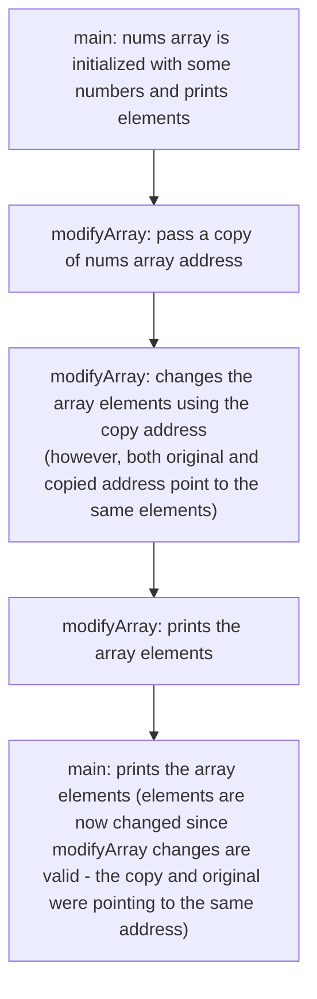

```mermaid
graph TD;
A["main: nums array is initialized with some numbers and prints elements"] --> B["modifyArray: pass a copy of nums array address"]
    B-->C["modifyArray: changes the array elements using the copy address
(however, both original and copied address point to the same elements)"];
    C-->D["modifyArray: prints the array elements"];
    D --> E["main: prints the array elements (elements are now changed since 
modifyArray changes are valid - the copy and original were pointing to the same address)"];
```