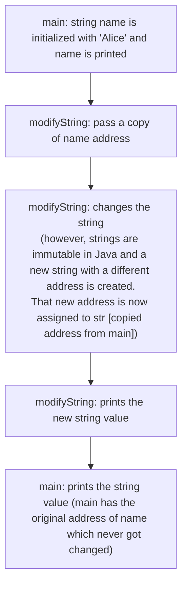

```mermaid
graph TD;
A["main: string name is initialized with 'Alice' and name is printed"] --> B["modifyString: pass a copy of name address"]
    B-->C["modifyString: changes the string
(however, strings are immutable in Java and a new string with a different address is created.
That new address is now assigned to str [copied address from main])"];
    C-->D["modifyString: prints the new string value"];
    D --> E["main: prints the string value (main has the original address of name 
          which never got changed)"];
```